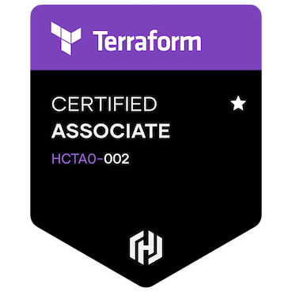

## Hey , I'm Scott Swensen — a DevOps Engineer 👨‍💻

### My Expertise:

DevOps and Software Engineering is something which coincides with my passion and hobby. Always up for a discussion on
software, business, and other opportunities. Lately, I have been immersed in a world of infrastructure as code, working
with Kubernetes and Docker to build scalable, secure, and maintainable apps.

### My Hobbies and Info:

- 🛠&nbsp; I'm constantly improving my personal Kubernetes cluster, completely built using Terraform and CI/CD pipelines.
- 🔐&nbsp; I’m currently exploring [1Password Service Accounts](https://blog.1password.com/1password-service-accounts/)
  for securing CI/CD pipelines.
- 👨🏻‍💻&nbsp; Most of my projects are available on [GitHub](https://github.com/sswensen).
- 🤓&nbsp; Fun fact: I can sometimes [exit vim](./assets/vim.jpg).
- 📫&nbsp; How to contact me: [hello@scottswensen.com](mailto:hello@scottswensen.com).

### My Passions:

- 💻 &nbsp; Exploring bleeding-edge tech stacks and developing new deployment strategies.
- 🔬 &nbsp; Deploying new apps and iterating my Homelab whenever possible.
- 🍕 &nbsp; Hackathons & coding competitions.

### Languages and Tools:

<code></code>
<code></code>
<code></code>
<code></code>
<code></code>
<code></code>
<code></code>
<code></code>
<code></code>
<code></code>
<code></code>

### Certifications:

### Dev Stuff:

  
<b>⚡ Github Stats</b>

  
  

	
  
<b>✍🏼 My DevOps Cheat Sheet</b>
 
  

  

---

### Thank you for reading, share your ❤️ by starring some of my repositories! 🌟

